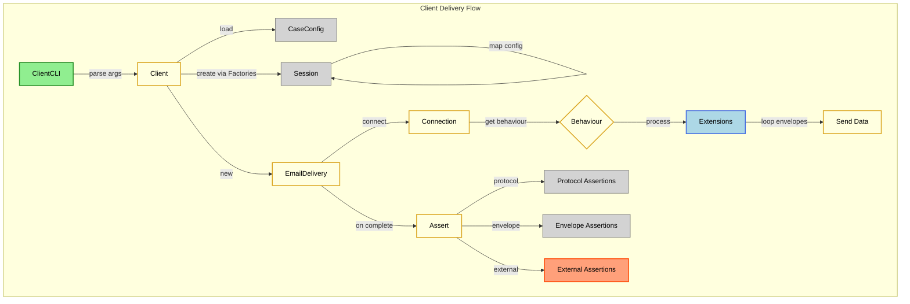
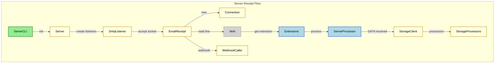
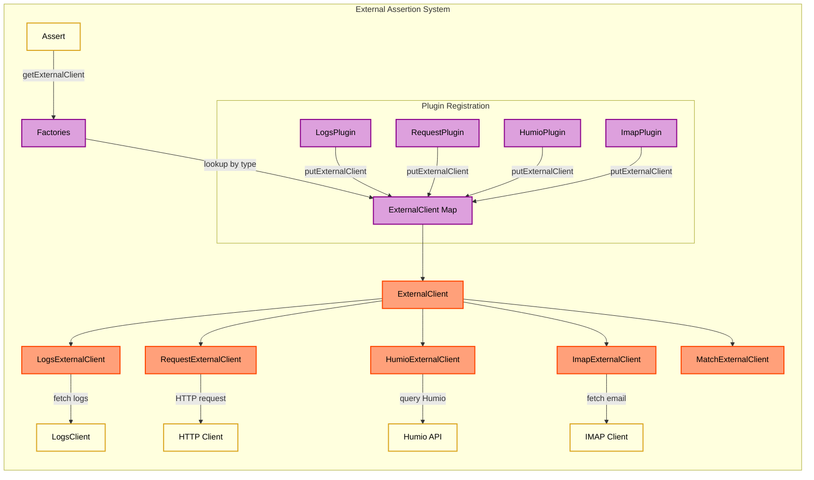
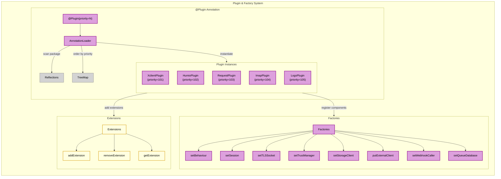
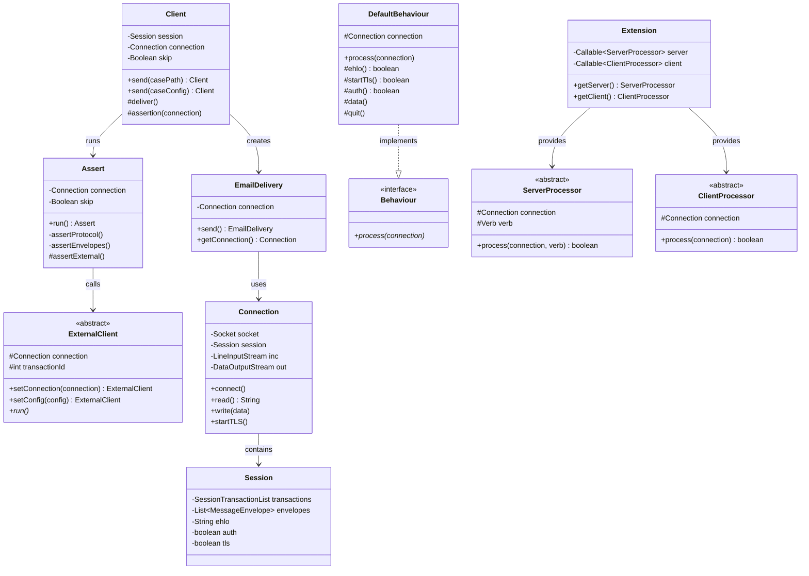

Flowchart
============
This illustrates the workflow of the application main classes for both client and server.

## Legend

| Color | Meaning |
|-------|---------|
| 🟢 Green | Entry points (CLI interfaces) |
| 🟡 Yellow | Core classes |
| 🔵 Blue | Extensions (Client/Server processors) |
| 🟣 Purple | Plugins and Factories |
| 🟠 Orange | External Assertions |
| ⚪ Gray | Data containers and utilities |

## Architecture Overview

```mermaid
flowchart TB
    subgraph Legend
        direction LR
        L1[Entry Point]:::entry
        L2[Core Class]:::core
        L3[Extension]:::extension
        L4[Plugin/Factory]:::plugin
        L5[External Assert]:::external
        L6[Data Container]:::data
    end

    subgraph ClientFlow["Client Flow"]
        direction TB
        ClientCLI[ClientCLI]:::entry --> ClientClass[Client]:::core
        ClientClass --> CaseConfig[CaseConfig]:::data
        ClientClass --> SessionC[Session via Factories]:::data
        ClientClass --> EmailDelivery[EmailDelivery]:::core
        EmailDelivery --> ConnectionC[Connection]:::core
        ConnectionC --> BehaviourSelect{Behaviour Selection}:::core
        BehaviourSelect -->|"Empty behaviour list"| DefaultBehaviour[DefaultBehaviour]:::core
        BehaviourSelect -->|"Custom behaviour list"| CustomBehaviour[CustomBehaviour]:::core
        DefaultBehaviour --> ClientExtensions
        CustomBehaviour --> ClientExtensions
        
        subgraph ClientExtensions["Client Extensions"]
            direction TB
            ClientProcessor[ClientProcessor]:::extension
            ClientEhlo[ClientEhlo]:::extension
            ClientStartTls[ClientStartTls]:::extension
            ClientAuth[ClientAuth]:::extension
            ClientMail[ClientMail]:::extension
            ClientRcpt[ClientRcpt]:::extension
            ClientData[ClientData]:::extension
            ClientRset[ClientRset]:::extension
            ClientHelp[ClientHelp]:::extension
            ClientQuit[ClientQuit]:::extension
            ClientXclient[ClientXclient]:::extension
        end
        
        EmailDelivery --> AssertFlow
    end

    subgraph AssertFlow["Assertion Flow"]
        direction TB
        Assert[Assert]:::core
        Assert -->|"Protocol assertions"| SessionTransactionList[SessionTransactionList]:::data
        Assert -->|"Envelope assertions"| EnvelopeTransactionList[EnvelopeTransactionList]:::data
        Assert -->|"External assertions"| ExternalClients
        
        subgraph ExternalClients["External Assertion Clients"]
            direction TB
            ExternalClient[ExternalClient]:::external
            LogsExternalClient[LogsExternalClient]:::external
            RequestExternalClient[RequestExternalClient]:::external
            HumioExternalClient[HumioExternalClient]:::external
            ImapExternalClient[ImapExternalClient]:::external
            MatchExternalClient[MatchExternalClient]:::external
        end
    end

    subgraph Server["Server Flow"]
        direction TB
        ServerCLI[ServerCLI]:::entry --> ServerMain[Server]:::core
        ServerMain --> SmtpListener[SmtpListener]:::core
        SmtpListener -->|"Thread per connection"| EmailReceipt[EmailReceipt]:::core
        EmailReceipt --> ConnectionS[Connection]:::core
        ConnectionS --> VerbParse[Verb Parsing]:::data
        VerbParse --> ServerExtensions
        EmailReceipt -->|"Webhook events"| WebhookCaller[WebhookCaller]:::core
        
        subgraph ServerExtensions["Server Extensions"]
            direction TB
            ServerProcessor[ServerProcessor]:::extension
            ServerEhlo[ServerEhlo]:::extension
            ServerStartTls[ServerStartTls]:::extension
            ServerAuth[ServerAuth]:::extension
            ServerMail[ServerMail]:::extension
            ServerRcpt[ServerRcpt]:::extension
            ServerData[ServerData]:::extension
            ServerRset[ServerRset]:::extension
            ServerHelp[ServerHelp]:::extension
            ServerQuit[ServerQuit]:::extension
            ServerXclient[ServerXclient]:::extension
        end
        
        ServerData --> StorageProcessors
        
        subgraph StorageProcessors["Storage Processors"]
            direction TB
            StorageClient[StorageClient]:::core
            LocalStorageClient[LocalStorageClient]:::core
            AVStorageProcessor[AVStorageProcessor]:::core
            SpamStorageProcessor[SpamStorageProcessor]:::core
        end
    end

    subgraph Connection["Connection & Session"]
        direction TB
        Conn[Connection]:::core
        Conn --> Socket[Socket]:::data
        Conn --> TLSSocket[TLSSocket via Factories]:::data
        Conn --> LineInputStream[LineInputStream]:::data
        Conn --> DataOutputStream[DataOutputStream]:::data
        Conn --> Sess[Session]:::data
        Sess --> STL[SessionTransactionList]:::data
        STL --> ETL[EnvelopeTransactionList]:::data
    end

    subgraph Extensions["Extensions Registry"]
        direction TB
        ExtensionsClass[Extensions]:::core
        ExtensionsClass --> ExtensionPair[Extension Pair]:::data
        ExtensionPair --> ServerProc[ServerProcessor]:::extension
        ExtensionPair --> ClientProc[ClientProcessor]:::extension
    end

    subgraph Plugins["Plugin System"]
        direction TB
        PluginAnnotation["@Plugin Annotation"]:::plugin
        AnnotationLoader[AnnotationLoader]:::plugin
        AnnotationLoader -->|"Priority ordered"| PluginInstances
        
        subgraph PluginInstances["Available Plugins"]
            direction TB
            XclientPlugin[XclientPlugin]:::plugin
            HumioPlugin[HumioPlugin]:::plugin
            RequestPlugin[RequestPlugin]:::plugin
            ImapPlugin[ImapPlugin]:::plugin
            LogsPlugin[LogsPlugin]:::plugin
        end
    end

    subgraph Factories["Factories Container"]
        direction TB
        FactoriesClass[Factories]:::plugin
        FactoriesClass --> BehaviourFactory["Behaviour"]:::plugin
        FactoriesClass --> SessionFactory["Session"]:::plugin
        FactoriesClass --> TLSSocketFactory["TLSSocket"]:::plugin
        FactoriesClass --> TrustManagerFactory["TrustManager"]:::plugin
        FactoriesClass --> StorageClientFactory["StorageClient"]:::plugin
        FactoriesClass --> ExternalClientFactory["ExternalClient Map"]:::plugin
        FactoriesClass --> WebhookCallerFactory["WebhookCaller"]:::plugin
        FactoriesClass --> QueueDatabaseFactory["QueueDatabase"]:::plugin
    end

    %% Cross-subgraph connections
    ClientClass -.->|"uses"| Conn
    EmailReceipt -.->|"uses"| Conn
    PluginInstances -.->|"registers"| FactoriesClass
    PluginInstances -.->|"registers"| ExtensionsClass
    FactoriesClass -.->|"provides"| SessionC
    FactoriesClass -.->|"provides"| ExternalClients
    ExtensionsClass -.->|"provides"| ClientExtensions
    ExtensionsClass -.->|"provides"| ServerExtensions

    classDef entry fill:#90EE90,stroke:#228B22,stroke-width:2px,color:#000
    classDef core fill:#FFFFE0,stroke:#DAA520,stroke-width:2px,color:#000
    classDef extension fill:#ADD8E6,stroke:#4169E1,stroke-width:2px,color:#000
    classDef plugin fill:#DDA0DD,stroke:#8B008B,stroke-width:2px,color:#000
    classDef external fill:#FFA07A,stroke:#FF4500,stroke-width:2px,color:#000
    classDef data fill:#D3D3D3,stroke:#696969,stroke-width:1px,color:#000
```

## Client Flow Details

## Server Flow Details

## External Assertions Detail

## Plugin and Factories System

## Default Extensions

The following SMTP extensions are registered by default:

| Verb | Server Processor | Client Processor |
|------|-----------------|------------------|
| `HELO` | ServerEhlo | ClientEhlo |
| `LHLO` | ServerEhlo | ClientEhlo |
| `EHLO` | ServerEhlo | ClientEhlo |
| `STARTTLS` | ServerStartTls | ClientStartTls |
| `AUTH` | ServerAuth | ClientAuth |
| `MAIL` | ServerMail | ClientMail |
| `RCPT` | ServerRcpt | ClientRcpt |
| `DATA` | ServerData | ClientData |
| `BDAT` | ServerBdat | ClientBdat |
| `RSET` | ServerRset | ClientRset |
| `HELP` | ServerHelp | ClientHelp |
| `QUIT` | ServerQuit | ClientQuit |
| `XCLIENT` | ServerXclient | ClientXclient |

## External Assertion Types

| Type | Plugin | Client Class | Purpose |
|------|--------|--------------|---------|
| `logs` | LogsPlugin | LogsExternalClient | Assert against MTA logs |
| `request` | RequestPlugin | RequestExternalClient | HTTP/S request assertions |
| `humio` | HumioPlugin | HumioExternalClient | Query Humio log platform |
| `imap` | ImapPlugin | ImapExternalClient | Verify email delivery via IMAP |

## Class Relationships

